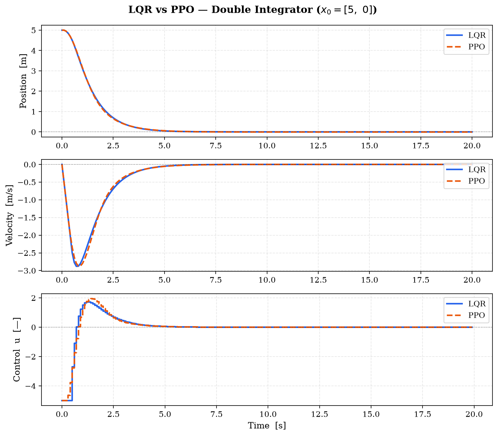
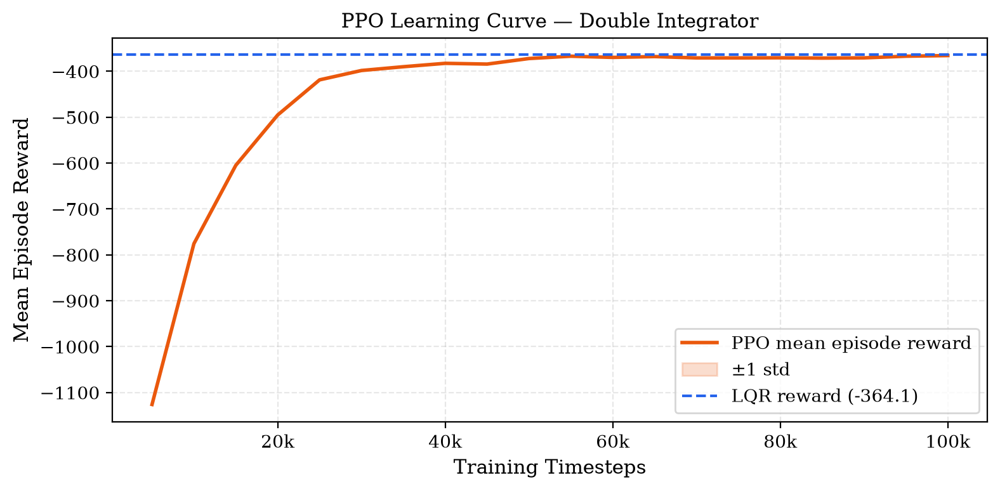

# LQR vs Reinforcement Learning — Double Integrator

A project comparing **Linear Quadratic Regulation (LQR)** and **Proximal Policy
Optimisation (PPO)** on a discrete-time double integrator — a canonical second-order
system from classical control theory.

LQR solves the problem analytically by computing the solution to the Discrete
Algebraic Riccati Equation (DARE). PPO learns a control policy purely through
environment interaction, with no knowledge of the system dynamics. Both are solving
the same Bellman equation. The difference is only in what information is available.

---

## Results

| Metric | LQR | PPO |
|---|---|---|
| Total cost $J$ | 364.09 | 365.05 |
| Theoretical minimum $J^*$ | 345.68 | 345.68 |
| Suboptimality vs $J^*$ | 5.33% | 5.60% |
| Settling time | 4.40 s | 4.50 s |
| Peak \|u\| | 5.000 | 5.000 |
| **PPO cost gap vs LQR** | — | **+0.26%** |
| **Action correlation with LQR** | — | **0.987** |

After 100,000 training steps, PPO achieves a cost within **0.26%** of the LQR
optimum and a control signal correlation of **r = 0.987** with the LQR signal —
meaning it effectively rediscovered the linear feedback law $u \approx -Kx$ without
ever observing the system matrices $A$ or $B$.

### Trajectory Comparison



### PPO Learning Curve



*The dashed line marks the LQR episode reward. PPO reaches within 0.5% of LQR
by 50k steps and plateaus near the optimum.*

---

## Problem

Control a discrete-time double integrator from $x_0 = [5,\ 0]^\top$ to the origin,
minimising the infinite-horizon quadratic cost:

$$J = \sum_{k=0}^{\infty} \left( x_k^\top Q x_k + u_k^\top R u_k \right), \qquad Q = I_2,\ R = 0.1$$

**System dynamics** (Euler discretisation of $\ddot{p} = u$ at $\Delta t = 0.1$ s):

$$x_{k+1} = Ax_k + Bu_k, \qquad
A = \begin{bmatrix}1 & 0.1 \\ 0 & 1\end{bmatrix},\quad
B = \begin{bmatrix}0 \\ 0.1\end{bmatrix}$$

State $x = [\text{position},\ \text{velocity}]^\top$. Action $u \in [-5,\ 5]$ (continuous).
Both eigenvalues of $A$ are $+1$ — the open-loop system is marginally stable and
requires active feedback to converge.

**Two solvers. Same objective. Different information.**

| | LQR | PPO |
|---|---|---|
| Knows $A$, $B$? | Yes | No |
| Solves | DARE → $P$, $K$ analytically | Clipped surrogate loss + GAE |
| Policy form | Linear: $u_k = -Kx_k$ | Neural network $\pi_\theta(u \mid x)$ |
| Value function | $V^*(x) = x^\top P x$ (exact) | MLP approximation of $V^*$ |
| Optimality | Provably optimal (unconstrained LQ) | Near-optimal (empirical) |

---

## The Core Insight

The RL reward is defined as the negative LQR stage cost:
$$
r_k = -\!\left(x_k^\top Q x_k + u_k^\top R u_k\right)
$$

Maximising $\sum_k r_k$ is **identical** to minimising $J$. Both LQR and PPO are therefore solving the same Bellman optimality equation:

$$
$$
V^\star(x) = \min_u \{ x^\top Qx + u^\top Ru + V^\star(Ax+Bu) \}
$$
$$

LQR exploits the linear-quadratic structure to solve this analytically—the solution is the DARE, and $V^\star(x) = x^\top Px$. PPO approximates the same $V^\star(x)$ with a neural network, using only sampled transitions. The neural network is learning to represent what is, for this problem, a quadratic function.
### LQR Solution

$$P = \begin{bmatrix}13.827 & 3.868 \\ 3.868 & 4.962\end{bmatrix}, \qquad
K = \begin{bmatrix}2.585 & 3.575\end{bmatrix}$$

$$u_k = -2.585\,p_k - 3.575\,v_k$$

Closed-loop eigenvalues of $A - BK$: $\{0.899,\ 0.743\}$ — both strictly
inside the unit circle, guaranteeing asymptotic stability.

---

## Project Structure

```
LQRvsRL/
├── envs/
│   └── double_integrator_env.py   # Shared Gymnasium environment (used by both)
├── controllers/
│   ├── lqr.py                     # DARE solver, LQRController class
│   └── rl_agent.py                # PPO training, LearningCurveCallback, evaluation
├── analysis/
│   ├── plots.py                   # All figure generation
│   └── compare.py                 # Metrics, comparison table, LaTeX table output
├── report/
│   ├── report.tex                 # Full LaTeX writeup
│   └── report.pdf                 # Compiled report
├── results/
│   └── figures/                   # Saved plots (committed)
├── run_lqr.py                     # Entry point: dynamics exploration + LQR
├── train_ppo.py                   # Entry point: PPO training
├── main_compare.py                # Entry point: full side-by-side comparison
└── requirements.txt
```

---

## Reproducing the Results

```bash
# 0. Install dependencies
pip install -r requirements.txt

# 1. Explore open-loop dynamics (zero input, sign controller, PD controller)
python run_lqr.py

# 2. Solve DARE, compute K, simulate LQR trajectory
python run_lqr.py --lqr

# 3. Train PPO agent (100k steps, ~2-3 min on CPU)
python train_ppo.py

# 4. Full comparison: metrics table + all figures + LaTeX table
python main_compare.py
```

Optional flags:

```bash
python train_ppo.py --steps 50000      # shorter training run
python train_ppo.py --eval-only        # evaluate saved model without retraining
python main_compare.py --retrain       # retrain PPO then compare
python main_compare.py --rerun-lqr    # re-simulate LQR then compare
```

All figures are saved to `results/figures/`. Trajectory data and the trained
model are saved to `results/data/` (git-ignored; regenerate with the commands above).

---

## Report

A 4-page technical report (`report/report.pdf`) derives:

- The discrete-time Bellman equation and dynamic programming
- The DARE as the fixed-point of the Bellman equation for LQR
- PPO as approximate dynamic programming with neural function approximators
- Empirical comparison with analysis of the suboptimality sources

Compile locally:

```bash
cd report && pdflatex report.tex && pdflatex report.tex
```

---

## Dependencies

```
numpy, scipy, matplotlib    # numerics and plotting
gymnasium                   # RL environment interface
stable-baselines3           # PPO implementation
torch                       # neural network backend (via SB3)
```

Python 3.10+. All dependencies pinned in `requirements.txt`.